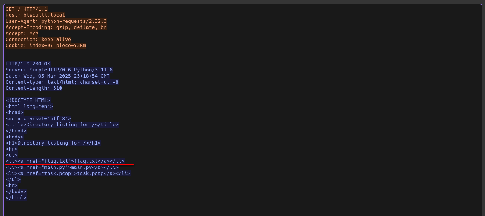
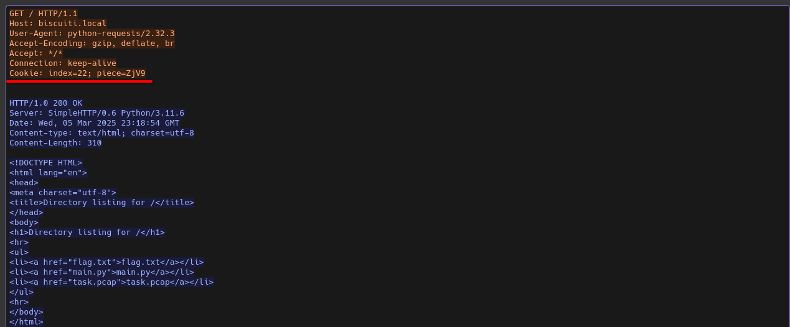
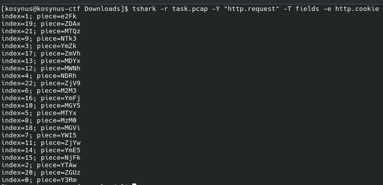

**Platform:**  CyberEDU
**Category:**  Network
**Difficulty:**  Easy
**Date:** 2026-08-12  
**Tags:** network

---

## Overview
The main task is to obtain the secret from the given pcap file

## Reconnaissance
276 packets in this capture, we can do a quick manual analysis, sort packet by length descending, click first packet follow its tcp stream and we find the first clue:

We assume that flag.txt is what we have to find but after exporting http objects I saw that there were no .txt files only text/html files, the page that appears in the first screenshot and after a little while I observed that each GET request has a Cookie in its header:

In order to automate the process, we will use `tshark -r task.pcap -Y "http.request" -T fields -e http.cookie` to easily retract each cookie from the packets with a GET request: 

Concatenate each index in ascending order and we get a string in base64, decoding it we get the flag.
## Flag / Root

`ctf{ada00bfd44a1613c7ab93345970f9f601ca061ba961dbacfea0ebd01de3143f5}` 

Q2.În contextul tehnicilor de exfiltrare a datelor într-o rețea, ce metodă este descrisă atunci când datele sensibile sunt împărțite în bucăți mici și transmise folosind câmpurile din antetele HTTP?

A: HTTP Cookie Smuggling
