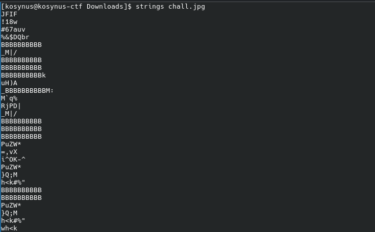
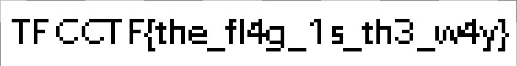

**Platform:**  CyberEDU
**Category:**  Forensics, Misc
**Difficulty:**  Entry Level
**Date:** 2026-08-18  
**Tags:** forensics, misc, tfc ctf 2022

---

## Overview
We are given an archive with a .jpg within it and we need to find the flag

## Reconnaissance

First thing we run `strings` on the .jpg and we see that there are a lot of strings `BBBBBBBBBB` inside the image, also if we try to open the image nothing loads

Something not so common, let's remove the B's from the image, I saw that all of them have the same string length so we can easily delete them with this command: `sed -i 's/BBBBBBBBBB//g' chall.jpg`, after we run it the image now loads the flag

## Flag 
`TFCCTF{the_fl4g_1s_th3_w4y}` 

