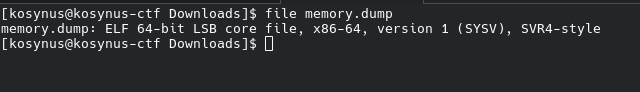
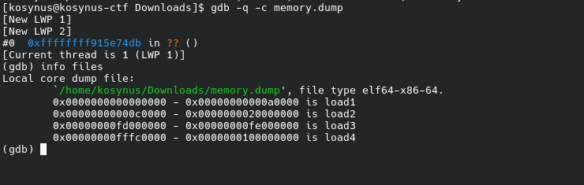
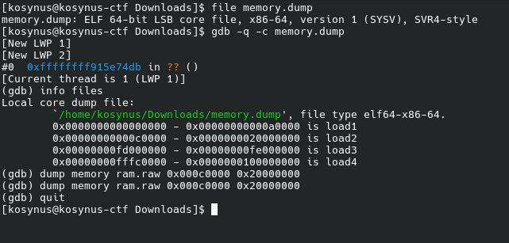
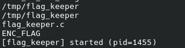
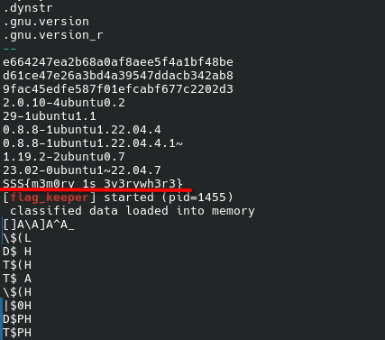

**Platform:**  CyberEDU
**Category:**  Forensics
**Difficulty:**  Entry Level
**Date:** 2026-08-18  
**Tags:** forensics

---

## Overview
We are given a `memory.dump` file and we need to get the flag from this image

## Reconnaissance

First we check to see the file type in order to determine what we're working on

So it is a core dump of a system/virtual machine, not a binary executable, by the name of the file it suggests that we should check the memory segments in gdb

`load2` is the largest memory segment, after some computation we find out that it equals exactly to 512 MB so we guess that this is the RAM memory of the linux kernel, we will extract this segment 

We will do strings now in order to see if we find something related to the flag using this command `strings -a ram.raw | grep -i "flag" | grep -vE "REC->|flags:|flags =|arch_|perf_|irq"`, this will scan the whole `ram.raw` file, filter for the `flag` keyword and the last pipe is an exclusion filter were `-v` inverts match all the lines that contain the specified strings and `-E` enables extended regular expressions, after looking at the output we find this:

`flag_keeper`, now we will use `strings -a ram.raw | grep -C 10 "flag_keeper"` in order to get 10 lines before and 10 lines after something related to `flag_keeper` happens, and after some search we found the flag:

## Flag 
`SSS{m3m0ry_1s_3v3rywh3r3}` 