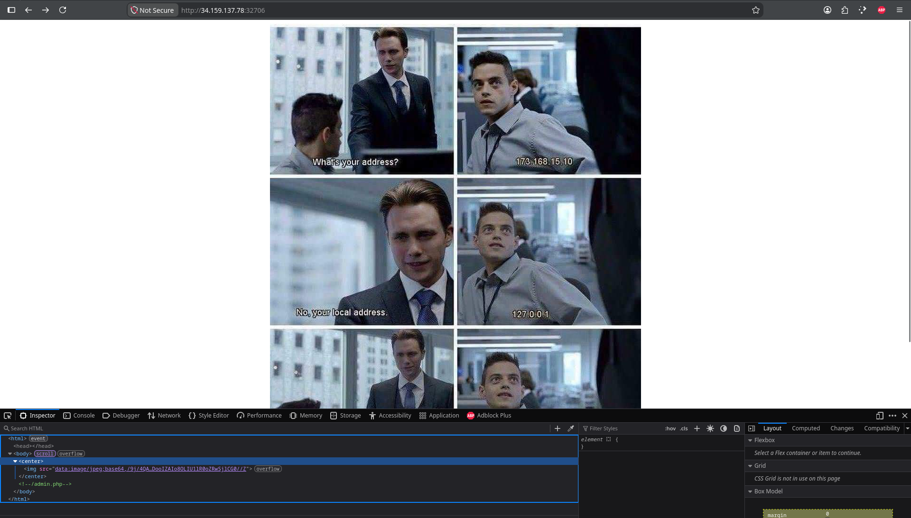
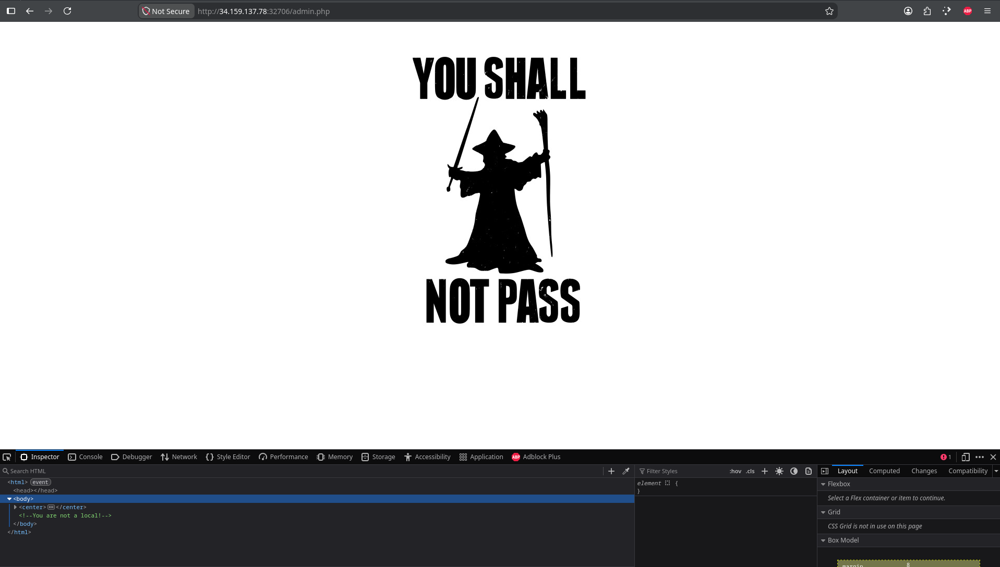
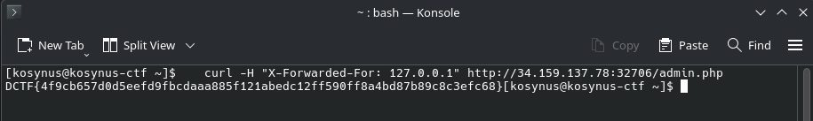

**Platform:**  CyberEDU
**Category:**  Web
**Difficulty:**  Entry Level
**Date:** 2026-08-25  
**Tags:** web, d-ctf 2019 - quals phase

---

## Overview
Description of the CTF: What is your address?

## Reconnaissance

First we open the service in a web browser and see what it shows:

Looks like a meme, but if we look into the HTML code we see a comment `admin.php`, let's check that

`You shall not pass`, but we get a hint, you are not local, lets use `curl` and forward for localhost: `curl -H "X-Forward-For: 127.0.0.1" http://34.159.137.78:32706/admin.php` and see what happens

Voila
## Flag / Root
`DCTF{4f9cb657d0d5eefd9fbcdaaa885f121abedc12ff590ff8a4bd87b89c8c3efc68}`
