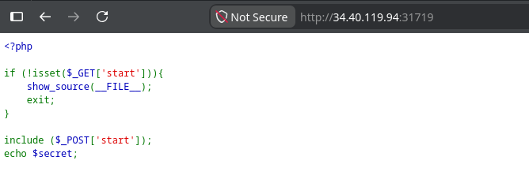
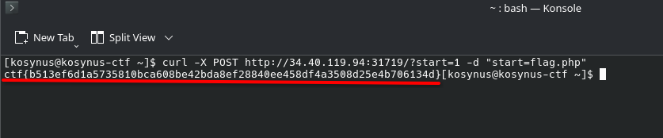

**Platform:**  CyberEDU
**Category:**  Web
**Difficulty:**  Entry Level
**Date:** 2026-08-19  
**Tags:** web, d-ctf 2020 online

---

## Overview
Keep it local and you should be fine. The flag is in /var/www/html/flag.php.
That's the descritpion of the challange

## Reconnaissance

When we open the service, first things we see is this:

We assume this code runs on the backend of this application. In this case, the vulnerability is pretty straight forward, we need to populate the `start` variable on the `GET` request and do a local file inclusion on the `POST` request, we will run the following curl command: `curl -X POST http://34.40.119.94:31719/?start=1 -d "start=flag.php"` 

## Flag 
`ctf{b513ef6d1a5735810bca608be42bda8ef28840ee458df4a3508d25e4b706134d}`
