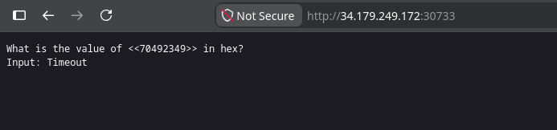
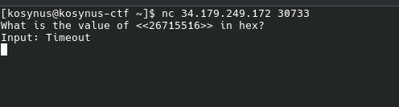
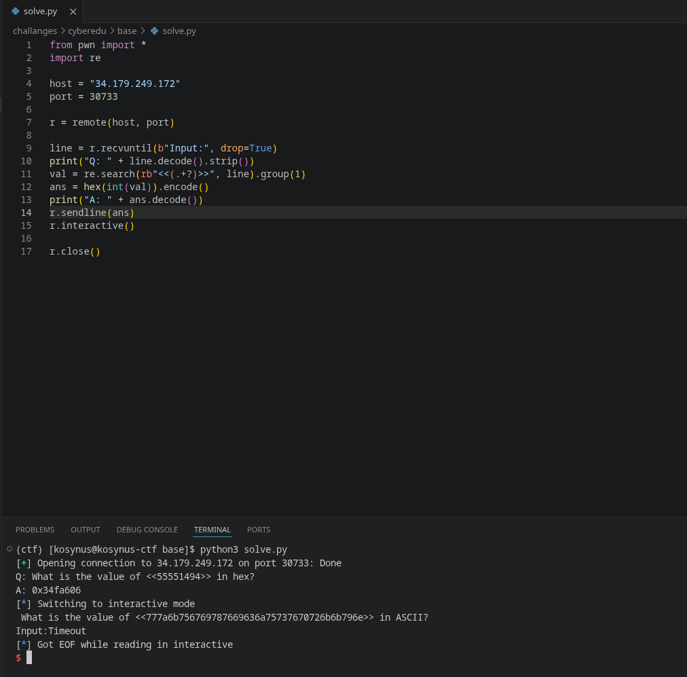
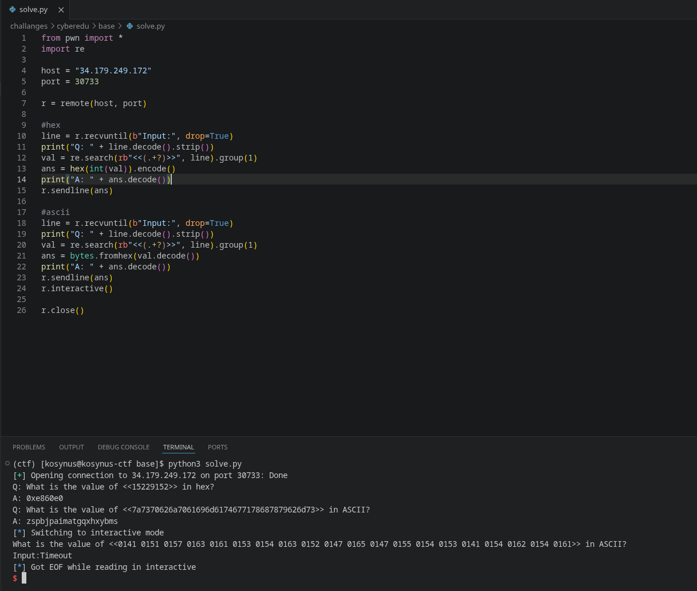
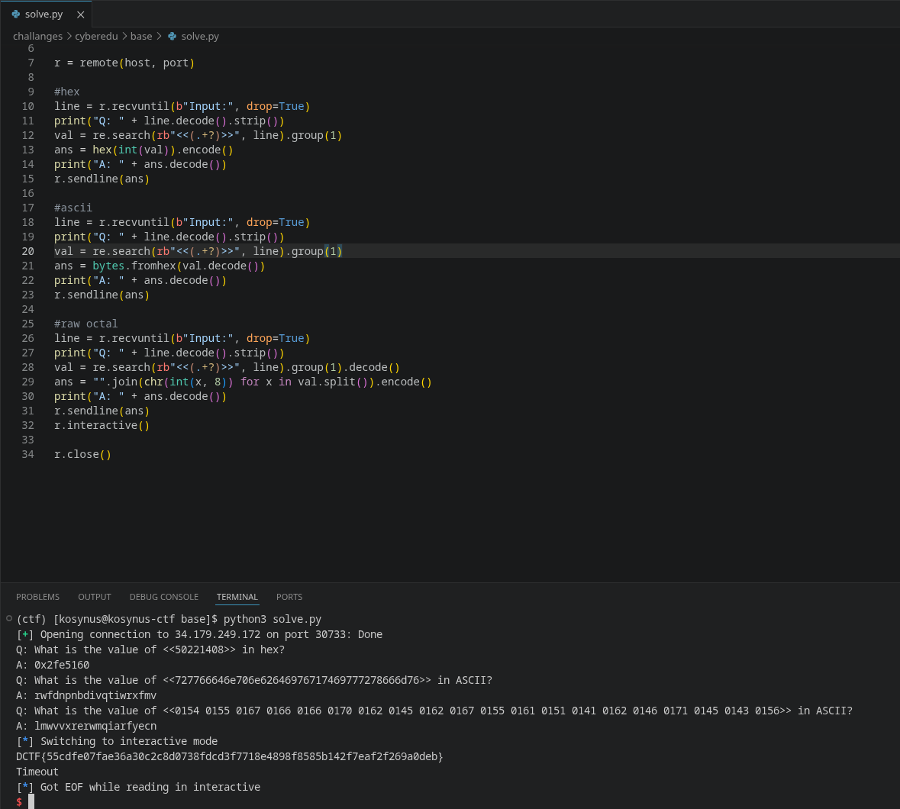

**Platform:**  CyberEDU
**Category:**  Misc, Programming
**Difficulty:**  Entry Level
**Date:** 2026-08-24  
**Tags:** misc, programming, d-ctf 2019 - quals phase

---

## Overview
Description of the challange: You have some simple questions. But you need to be fast.
## Reconnaissance

If we access from browser the service, we see this:



So we will use `netcat` to see how it reacts



After a very short time, we get `Timeout`, so we need to send the input fast, the value between `<<>>` changes so we will write a python script that connects to this service and sends the payload



As we can see, there is another question following up, so we will modify the code further
in order to complete that one too



Comlpeting the ascii challange too, `r.interactive()` shows us that we have 1 more challange to complete



And the flag appears after the 3rd challange being completed, below is the code

```python
from pwn import *
import re

host = "34.179.249.172"
port = 30733

r = remote(host, port)

#hex
line = r.recvuntil(b"Input:", drop=True)
print("Q: " + line.decode().strip())
val = re.search(rb"<<(.+?)>>", line).group(1)
ans = hex(int(val)).encode()
print("A: " + ans.decode())
r.sendline(ans)

#ascii
line = r.recvuntil(b"Input:", drop=True)
print("Q: " + line.decode().strip())
val = re.search(rb"<<(.+?)>>", line).group(1)
ans = bytes.fromhex(val.decode())
print("A: " + ans.decode())
r.sendline(ans) 

#raw octal
line = r.recvuntil(b"Input:", drop=True)
print("Q: " + line.decode().strip())
val = re.search(rb"<<(.+?)>>", line).group(1).decode()
ans = "".join(chr(int(x, 8)) for x in val.split()).encode()
print("A: " + ans.decode())
r.sendline(ans)

#flag
line = r.recvuntil(b"}")
print("FLAG: " + line.decode().strip())

r.close()
```

## Flag / Root
`DCTF{55cdfe07fae36a30c2c8d0738fdcd3f7718e4898f8585b142f7eaf2f269a0deb}`
