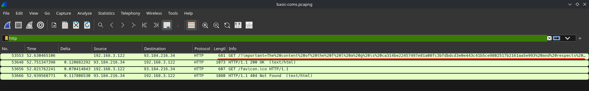

**Platform:**  CyberEDU
**Category:**  Forensics
**Difficulty:**  Entry Level
**Date:** 2026-08-19  
**Tags:** forensics, d-ctf 2020 online

---

## Overview
We are given a .pcapng file and need to investigate further in order to find the flag

## Reconnaissance

Open the `.pcapng` capture, filter by `http` and the flag appears in an instant:

The content of the flag is `ca314be22457497e81a08fc3bfdbdcd3e0e443c41b5ce9802517b2161aa5e993` and respects...
## Flag 
`CTF{ca314be22457497e81a08fc3bfdbdcd3e0e443c41b5ce9802517b2161aa5e993}`

