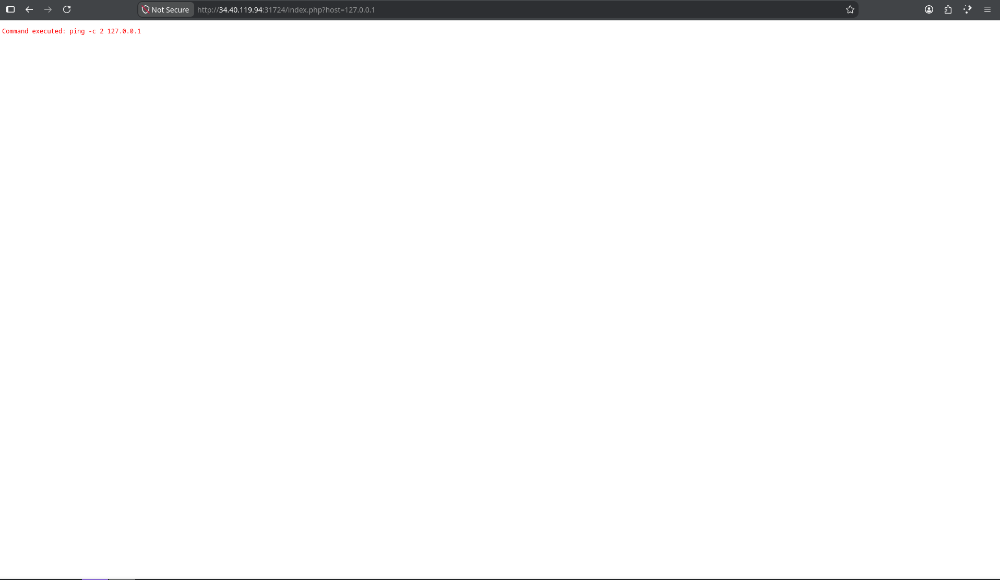
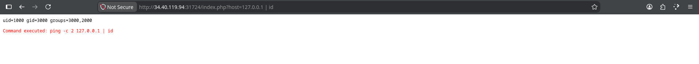
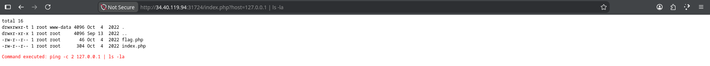
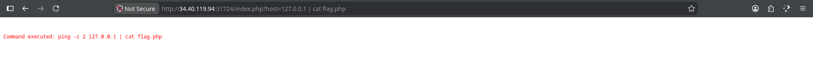
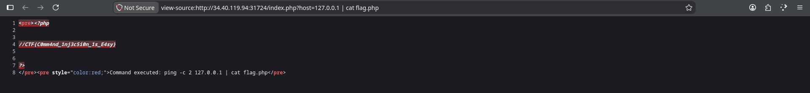

**Platform:**  CyberEDU
**Category:**  Web
**Difficulty:**  Entry Level
**Date:** 2026-08-14  
**Tags:** web, tfc ctf 2022

---

## Overview
We are given a service that we need to interact with to find the flag
## Reconnaissance

First we open the link and see what we've got

This could mean command injection vulnerability is available on this service, further testing should be done in order to confirm this

Using the pipeline in order to connect more commands, the command injection vulnerability is confirmed, further reconnaissance will be done, lets list all the files and see what we have

Check `flag.php` 

Nothing shows up, could be because the `.php` file has tags that the HTML does not recognise and the output goes into the DOM of the page, check the source page.

Voila
## Flag
`CTF{C0mm4nd_1nj3c5i0n_1s_E4sy}` 

