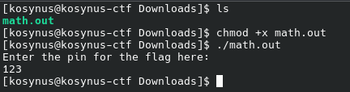
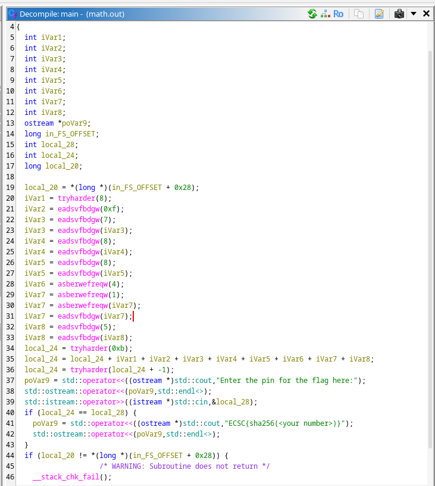
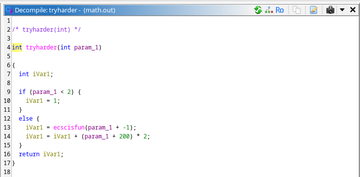
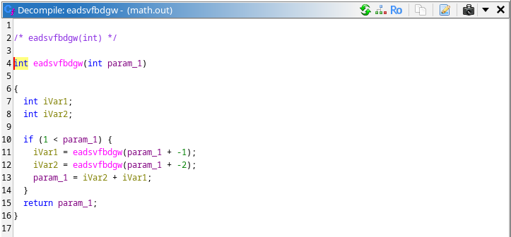
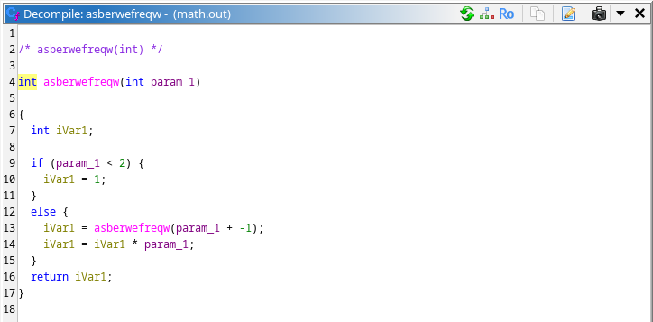

**Platform:**  CyberEDU
**Category:**  Reverse Engineering
**Difficulty:**  Entry Level
**Date:** 2026-08-13  
**Tags:** ecsc 2019 ro quals, reverse engineering

---

## Overview
We are given a file named "math.out" and we have to figure out what to do with it

## Reconnaissance

First we give execute permissions to the file and run it:

Nothing happens so we load it in ghidra

Having the decompiled code here, we can easily see that the format of the flag is `ECSC{sha256(pinCode)}`. The pin is stored in the `local_24` variable which is a sum of different variables. Let's check each function what it does and compute the pin later.

These 2 functions work together, both calling each other recursively until it reaches the base case 1, after that the computation begins `0x539 = 1337`, this can be either be done by rewriting this code and run it or on papaer, so the final result for the first variable, `tryharder(8) = 5682` 

This is classic fibbonacci

And this is factorial, so after every computation is done, the value in `local_24` will be: `local_24 = 8816 + 5682 + 610 + 233 + 10946 + 10946 + 24 + 1 + 5 = 37263` and the pin is the function `tryharder(local_24-1)` which results in the pin being `1420854615` 
## Flag 
`ECSC{70e0aacf1da33b84ab6235b03074c0ac7d0e12a6804d0931d5164cb77d6b3eb2}`
