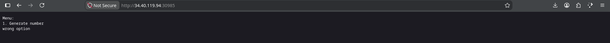
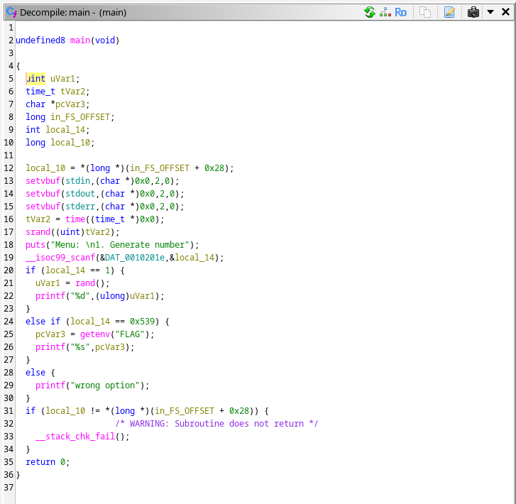
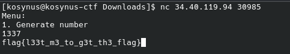

**Platform:**  CyberEDU
**Category:**  Pwn
**Difficulty:**  Entry Level
**Date:** 2026-08-14  
**Tags:** pwn, tfc ctf 2022

---

## Overview
We are given a service and a file main and we need to find the hidden flag

## Reconnaissance

First, if we enter this service on google we get this everytime we refresh:

We download the `main` file and load it into ghidra

The code is easy to read, in the variable `local_14` is stored the input, there is nothing related to overflow, 3 important if statements, first, if we input `1` the program will generate a random number, then if the input is `0x539 = 1337`, the program calls the function `getenv("FLAG")`, probably the flag lies in the `.env`, otherwise any other input will get the output `wrong option`, let's connect to the service using `netcat` and input `1337` 

Voila
## Flag
`flag{l33t_m3_to_g3t_th3_flag}` 