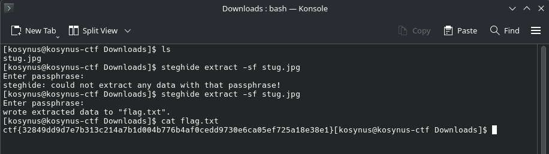

**Platform:**  CyberEDU
**Category:**  Steganography
**Difficulty:**  Entry Level
**Date:** 2026-08-19  
**Tags:** staganography, d-ctf 2020 online

---

## Overview
We are given a .jpg file and need to find what it hides

## Reconnaissance

First thing to do is to run `steghide` on the image without a password and nothing happens, but then I've returned back to the description which says `Do you have your own stug pass hidden withing` and after I've tried the password `stug` the `.txt` appeared

## Flag
`ctf{32849dd9d7e7b313c214a7b1d004b776b4af0cedd9730e6ca05ef725a18e38e1}`

