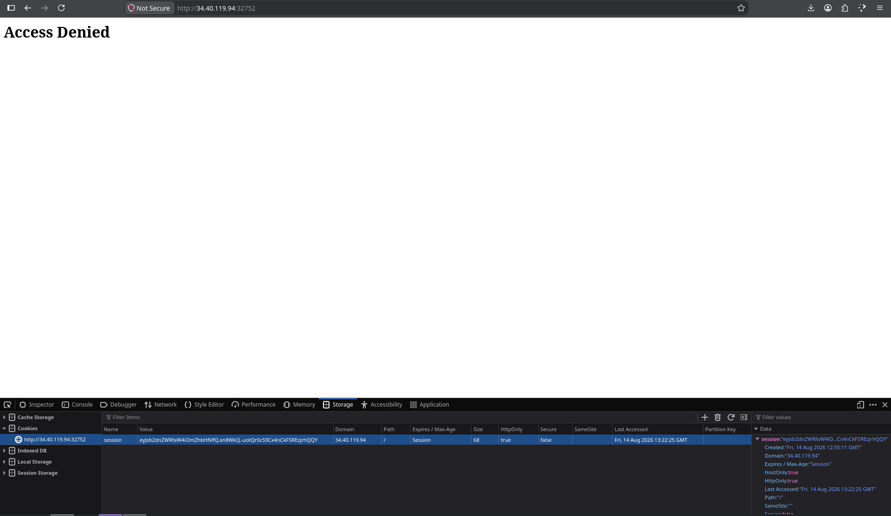
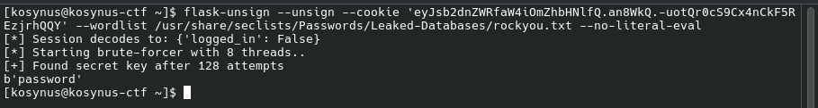
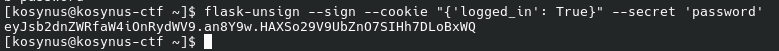
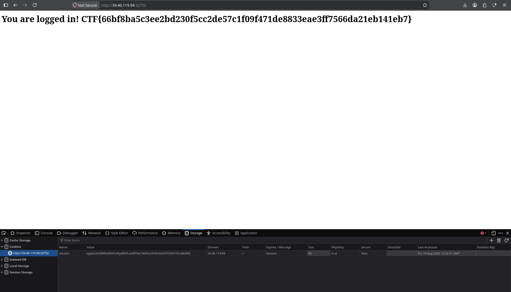

**Platform:**  CyberEDU
**Category:**  Web
**Difficulty:**  Entry Level
**Date:** 2026-08-14  
**Tags:** web, defcamp ctf 21-22

---

## Overview
We are given a service on web and we have to find the flag

## Reconnaissance

First thing we see when we enter the page is `Access Denied` so we look for things we can exploit. While searching we find the session cookie which looks like this: `eyJsb2dnZWRfaW4iOmZhbHNlfQ.an8WkQ.-uotQr0cS9Cx4nCkF5REzjrhQQY` 

After some research, I found out that this is a flask token not a jwt one, so for that we will use `flask-unsign` to find the `secret` of the token and its payload

As we can see, we've found the payload `{'logged_in': False}` and the secret key which the token was encoded with was `password`. Now we want to change the state of the variable `logged_in` from `False` to `True` and encode te token with the same secret key.

Now we take the token, go back into the browser and replace the old session cookie with the new one we just forged and refresh the page

Voila
## Flag
`CTF{66bf8ba5c3ee2bd230f5cc2de57c1f09f471de8833eae3ff7566da21eb141eb7}` 
