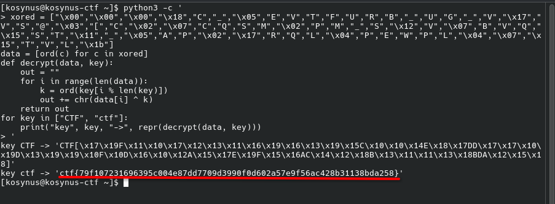

**Platform:**  CyberEDU
**Category:**  Cryptography
**Difficulty:**  Entry Level
**Date:** 2026-08-19  
**Tags:** cryptography, d-ctf 2020 online

---

## Overview
Description: Let's be fair, we all start with XOR, and we keep enjoying it.
We are also given a file `xor.py` and need to find the flag 

## Reconnaissance

```python
xored = ['\x00', '\x00', '\x00', '\x18', 'C', '_', '\x05', 'E', 'V', 'T', 'F', 'U', 'R', 'B', '_', 'U', 'G', '_', 'V', '\x17', 'V', 'S', '@', '\x03', '[', 'C', '\x02', '\x07', 'C', 'Q', 'S', 'M', '\x02', 'P', 'M', '_', 'S', '\x12', 'V', '\x07', 'B', 'V', 'Q', '\x15', 'S', 'T', '\x11', '_', '\x05', 'A', 'P', '\x02', '\x17', 'R', 'Q', 'L', '\x04', 'P', 'E', 'W', 'P', 'L', '\x04', '\x07', '\x15', 'T', 'V', 'L', '\x1b']
s1 = ""
s2 = ""
# ['\x00', '\x00', '\x00'] at start of xored is the best hint you get
a_list = [chr(ord(a) ^ ord(b)) for a,b in zip(s1, s2)]
print(a_list)
print("".join(a_list))
```

So the hint tells us that the key is a 24 bit key, because after te 3rd character there is no more `\x00`, xor property here `x ^ x = 0`, we could assume that the key is `CTF` or `ctf`, also `a ^ b ^ b = a`, so if we apply the key again on the already xored string we should get the plain text, let's try



We can easily see that our assumption was right
## Flag 
`ctf{79f107231696395c004e87dd7709d3990f0d602a57e9f56ac428b31138bda258}` 
