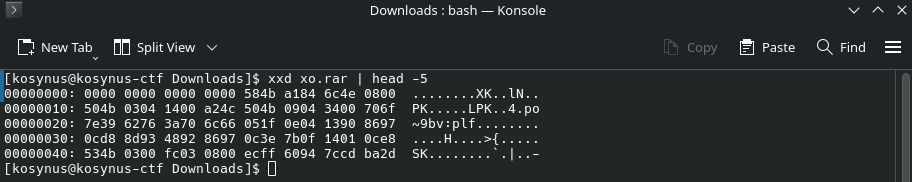
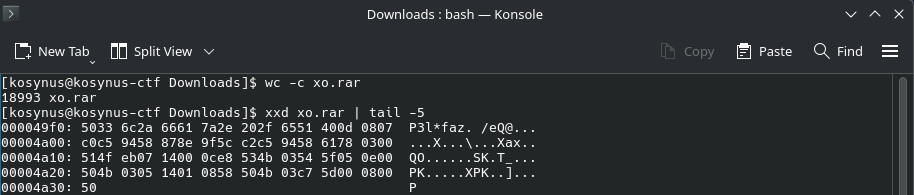
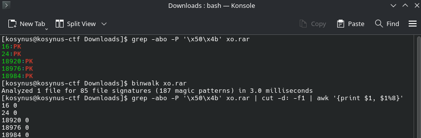
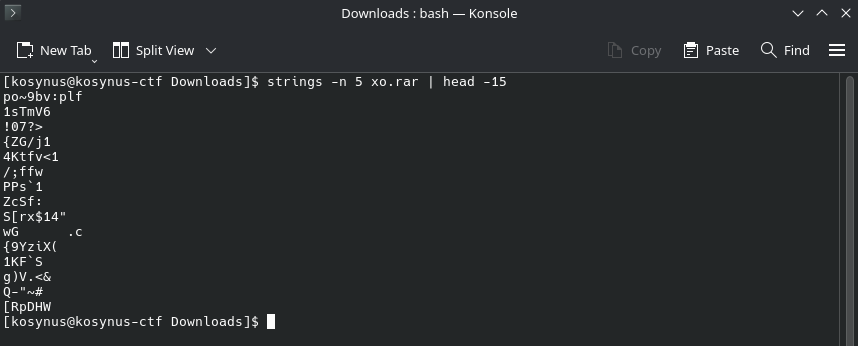
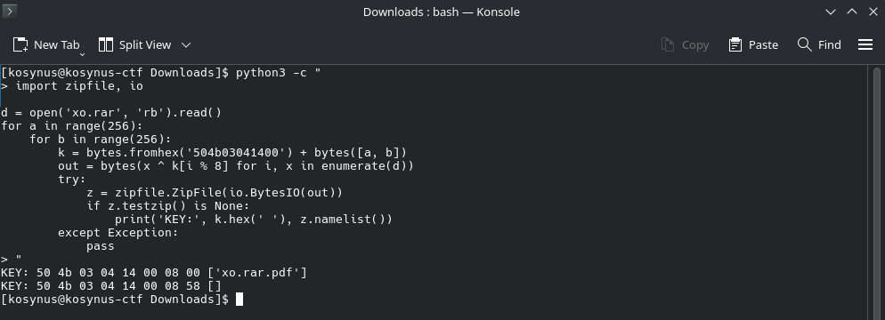
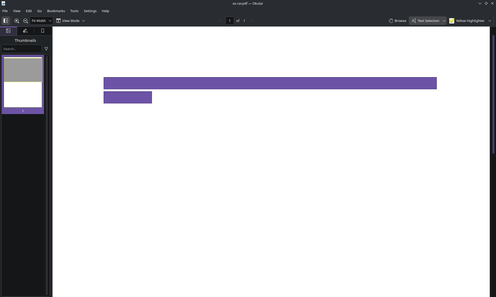

**Platform:**  CyberEDU
**Category:**  Forensics, Code Review
**Difficulty:**  Entry Level
**Date:** 2026-08-25  
**Tags:** forensics, code review, ecsc 2019 - ro quals

---

## Overview
We are given a `.rar` archive and we need to find the flag 

## Reconnaissance

Use `file` in order to see what we are working with:


Probably corrupted, lets see the bytes:



No magic number at all. The first 8 bytes are `00`, and nothing after them looks like a known file signature. Lets check the size and the end of the file:



The file is 18993 bytes and there is no End of Central Directory record (`50 4b 05 06`) at the end, so this is not a ZIP with a broken header, we can't just repair it.

At offset `0x10` there is `50 4b 03 04`, the ZIP local file header signature, so the `.rar` extension is probably a decoy. But the signature sits at `0x10` instead of `0x00`, and the fields that should follow it are garbage (`a2 4c` as general purpose flag, `50 4b` as compression method, when the valid compression methods are 0, 8, 9, 12, 14 and 93 to 98). So this is not a header sitting at the wrong place, the whole file has been transformed somehow. Lets map every `PK` occurrence in the file:



Only 5 hits, at offsets 16, 24, 18920, 18976 and 18984, and every single one is aligned to 8 bytes. For 5 random positions that would be a 1 in 32768 coincidence, so it is not random. `binwalk` finds no signature anywhere in the file, and `strings` returns only noise:



High entropy, so the content is compressed or encrypted.

Now we have three independent hints, all pointing to the same number:

- the first **8** bytes are null
- 18993 = **8** × 2374 + 1
- all `PK` occurrences are aligned to **8**

Together with the file name (**xo**.rar), this is XOR with an 8 byte repeating key. This also explains why we found no End of Central Directory record earlier it is there, but XORed like everything else.

The 8 null bytes at the start are not something that was overwritten. `plaintext XOR key = 0` only when both values are equal, so **the key is exactly the original first 8 bytes of the file** — the signature erased itself.

We already know the plaintext is a ZIP, so those 8 bytes are:

- `0x00` - `0x03` is `50 4b 03 04`, the ZIP local file header signature
- `0x04` - `0x05` is the version needed to extract, `14 00` (2.0)
- `0x06` - `0x07` is the general purpose flag, which we don't know

Note that the compression method is **not** part of the key, it lives at offset `0x08` - `0x09`, past the 8 byte boundary.

That leaves only 2 unknown bytes. The general purpose flag has no single obvious value we brute force all 65536 combinations and validate each candidate by trying to parse the result as a ZIP:

```python
import zipfile, io

d = open('xo.rar', 'rb').read()
for a in range(256):
    for b in range(256):
        k = bytes.fromhex('504b03041400') + bytes([a, b])
        out = bytes(x ^ k[i % 8] for i, x in enumerate(d))
        try:
            z = zipfile.ZipFile(io.BytesIO(out))
            if z.testzip() is None:
                print('KEY:', k.hex(' '), z.namelist())
        except Exception:
            pass
```



It runs in under a second and returns a single key: `50 4b 03 04 14 00 08 00`. The flag byte is `08`, which means bit 3 is set — the compressed and uncompressed sizes are stored in a data descriptor after the file data instead of in the header. That is typical when an archive is written as a stream, without seeking back to patch the header.

```python
d = open('xo.rar','rb').read()
key = bytes.fromhex('504b030414000800')
out = bytes(b ^ key[i % 8] for i, b in enumerate(d))
open('real.zip','wb').write(out)
print(out[:32].hex(' '))
```

Using the above script, we gain a zip file which has a `pdf` file inside it. If we open the pdf file there is a blank page, but if we select everything on the blank page something appears:



There is the flag
## Flag / Root
`ECSC{271254e9a1d893192ba42423a2ca98c7a520115daa3e57b6f89c9a206f5f0252}`